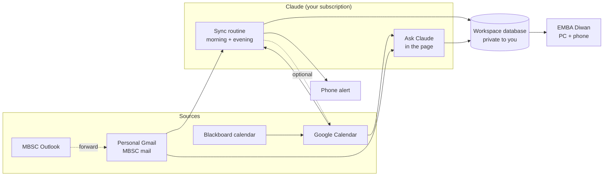

# EMBA Diwan

A private workspace for an Executive MBA at MBSC, run by Claude. It's one place for every deadline, class, email and note, on your computer and your phone. Claude keeps it up to date for you.

**Open it:** https://claude.ai/artifact/BrrZBD4T78NMkDyWDNbSDe. It's private, so sign in to claude.ai first. On a phone, open the link in Safari or Chrome and use **Add to Home Screen**. The Claude mobile app doesn't show these workspace pages yet.

## What's inside

| Section | What it does |
|---|---|
| **Today** | Morning brief from Claude, what needs you, what's coming up, and progress through the programme with a countdown to the next module. Riyadh time, with the Hijri date. |
| **Tasks** | Every assignment, reading and admin item, grouped by urgency (overdue, today, next 2 weeks, later). Claude adds them from your MBSC email; you can add, edit, push back or tick them off. |
| **Schedule** | Module weeks, classes and deadlines, plus your live Google Calendar (and Blackboard once you add its calendar). Weeks start on Sunday. |
| **Inbox** | Claude's digest of MBSC mail (what each email means for you and what to do), plus your live MBSC mail with one-tap “What does this mean for me?”. |
| **Ask Claude** | A chat that reads your workspace, searches your Gmail and checks your calendar before answering. It runs on your Claude plan and never sends anything. English or Arabic. |
| **Me** | Memory (what Claude should always know about you), programme facts, MBSC contacts, links, and the setup checklist. |

## How it works

- The **sync routine** runs twice a day. It reads new MBSC mail and your calendars, turns them into tasks, schedule items and a digest, writes the morning brief, and sends a phone alert when something needs you. The steps are in [`copilot/playbook.md`](copilot/playbook.md).
- The **page** reads the database live, so changes from either side show up immediately. It can also read your Gmail and Google Calendar directly, with your permission.
- **Memory** lives in the workspace too. Add a note on the Me page or tell Claude “remember…”. Every answer and every sync reads it.

## Repository layout

| Path | What |
|---|---|
| `workspace/index.html` | The workspace page (published as a private Claude artifact) |
| `copilot/playbook.md` | What each sync does |
| `copilot/data-model.md` | The database's collections and fields |
| `copilot/routine-prompt.md` | The scheduled routine's prompt (private values left out) |
| `docs/integrations.md` | Every MBSC platform: official and workaround ways to connect it |
| `docs/connect-sources.md` | Connecting Gmail, Blackboard, Outlook, the MBSC site, and the Claude vs ChatGPT question |
| `CLAUDE.md` | Standing instructions for every Claude session in this repo |

## Privacy

- Your data (tasks, emails, profile, memory) is stored only in the workspace's database, which only you can read or change. It is never written to this repository.
- This repository holds code and instructions only. It's currently **public**; making it private is recommended (GitHub → Settings → Danger Zone → Change visibility).
- Claude only reads your mail; it never sends, deletes or changes it. Passwords, codes and bank details are never copied anywhere.
